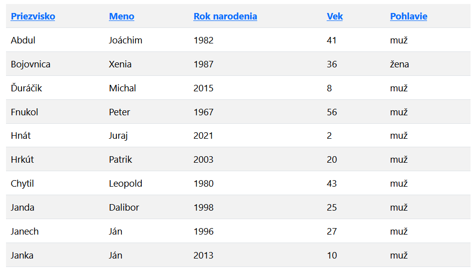
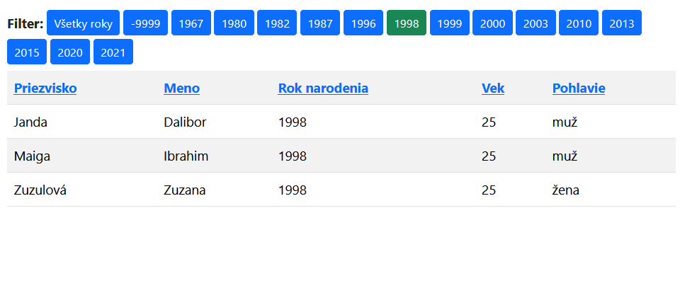

# VAII Cvičenie 05
Momentálne je otvorená branch __SOLUTION__, ktorá obsahuje riešenie. _Štartér_ obsahuje branch  __MAIN__.

## Úlohy

1. Implementujte triedu `Calculation`, ktorá bude mať metódu na výpočet faktoriálu.
    * Môžte použiť algoritmus z cvičenia 4.
    * Zobrazte výpočet faktoriálu na vlastnej stránke s využitím __MVC__ architektúry webu.
2. Doplňte ďalšou podstránku, ktorá zobrazí v cykle 10 nadpisov.
    * Použite ľubovolný HTML nadpis a v texte každého uveďte jeho poradové číslo.
3. Z priečinku `snippets` premiestnite do projektu triedu `PersonHelper`. Doplňte správny namespace.
    * Pre osoby vytvorte samostatný controller.
    * Načítajte osoby zo súboru `data/osoby.csv`.
    * Akcia `index` zobrazí textový zoznam načítaných osôb.
4. Osoby zobrazte v HTML tabuľke.
    * Tabuľka bude mať hlavičku a telo.
    * Bude obsahovať stĺpce: `Meno`, `Priezvisko`, `Rok narodenia`, `Vek`, `Pohlavie`.
5. Zoraďovanie tabuľky
    * Po kliknutí na hlavičku tabuľky sa dáta v tabuľke zoradia podľa príslušného stĺpca vzostupne.
6. Filtrovanie podľa roku
    * Nad tabuľku vypíšte zoznam rokov narodenia, ktoré majú osoby v zozname (bez duplicít).
    * Kliknutím na daný rok, zobrazte iba tie osoby, ktoré sa narodili v danom roku.
        * Nezabudnite, že zoraďovanie tabuľky musí fungovať aj s filtrom rokov.
        * Pridajte možnosť vypnúť filtrovanie podľa roku

### Ukážka tabuľky

### Tabuľka s filtrom

## Ako nájsť branch môjho cvičenia?
Pokiaľ sa chcete dostať k riešeniu z cvičenia je potrebné otvoriť si príslušnú _branch_, ktorej názov sa skladá:

__MIESTNOST__ + "-" + __HODINA ZAČIATKU__ + "-" + __DEN__

Ak teda navštevujete cvičenie pondelok o 08:00 v RA323, tak sa branch bude volať: __RA323-08-PON__

# Použitý framework

Cvičenie používa framework vaiicko dostupný na repe [https://github.com/thevajko/vaiicko](https://github.com/thevajko/vaiicko)
